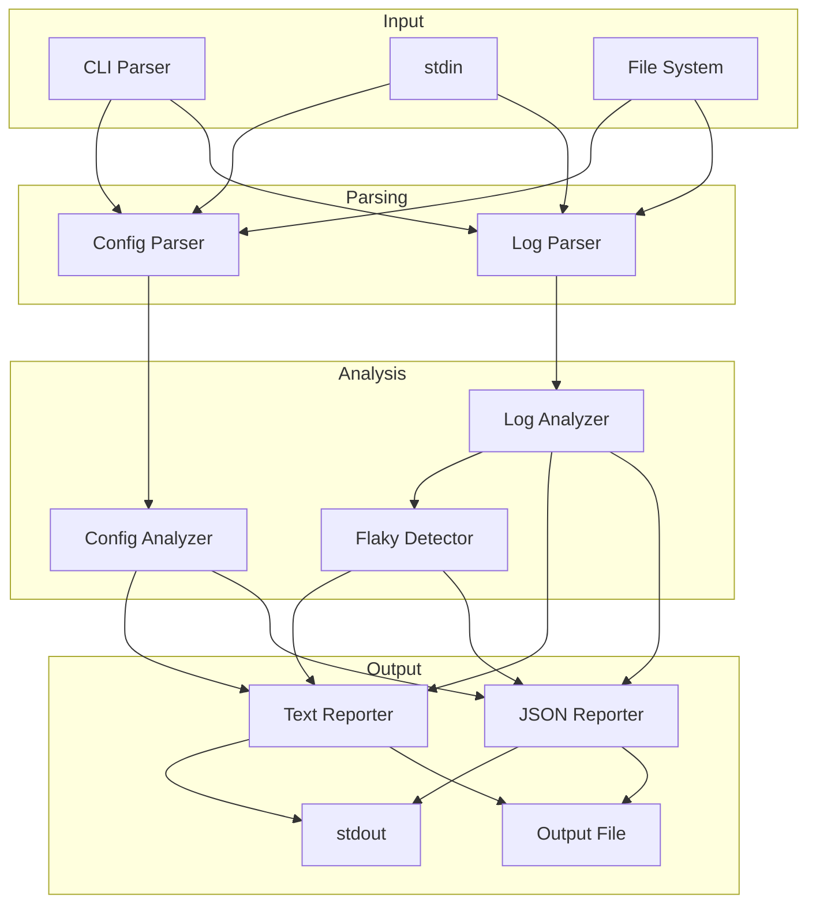

# Design Document

## Overview

ci-time-tracker is a Python CLI tool that analyzes CI/CD pipeline configurations and build logs to help teams identify performance bottlenecks and flaky steps. The tool operates in two modes: config-analysis (parsing pipeline YAML/JSON files) and log-analysis (parsing build logs for timing data). It outputs human-readable summaries or JSON reports suitable for dashboard integration.

The design prioritizes simplicity and maintainability with a flat module structure, minimal dependencies (stdlib + PyYAML), and clear separation between parsing, analysis, and reporting concerns.

## Architecture



### Component Flow

1. **CLI Entry Point**: Parses arguments, determines mode, routes to appropriate parser
2. **Parsers**: Extract structured data from config files or logs
3. **Analyzers**: Compute statistics, detect issues, aggregate results
4. **Reporters**: Format output as text or JSON

## Components and Interfaces

### CLI Module (`cli.py`)

```python
@dataclass
class CLIArgs:
    mode: Literal["config", "log"]
    input_paths: list[str]
    output_path: str | None
    output_format: Literal["text", "json"]
    estimates_file: str | None
    log_format: Literal["text", "json"] | None
    ci_provider: Literal["github", "gitlab", "circleci"] | None

def parse_args(argv: list[str]) -> CLIArgs:
    """Parse command-line arguments and return structured config."""
    
def main(argv: list[str] | None = None) -> int:
    """Main entry point, returns exit code."""
```

### Config Parser Module (`config_parser.py`)

```python
@dataclass
class PipelineStep:
    name: str
    stage: str | None
    command: str | None
    estimated_duration: float | None  # seconds

@dataclass
class PipelineConfig:
    provider: str
    steps: list[PipelineStep]
    stages: list[str]
    metadata: dict[str, Any]

def parse_config(content: str, provider: str | None = None) -> PipelineConfig:
    """Parse CI config content and return structured pipeline data."""

def detect_provider(content: str) -> str:
    """Auto-detect CI provider from config content."""

def parse_github_actions(data: dict) -> PipelineConfig:
    """Parse GitHub Actions workflow YAML."""

def parse_gitlab_ci(data: dict) -> PipelineConfig:
    """Parse GitLab CI YAML."""

def parse_circleci(data: dict) -> PipelineConfig:
    """Parse CircleCI config."""
```

### Log Parser Module (`log_parser.py`)

```python
@dataclass
class StepExecution:
    name: str
    start_time: datetime | None
    end_time: datetime | None
    duration_seconds: float | None
    status: Literal["success", "failure", "skipped"]
    is_retry: bool

@dataclass
class BuildLog:
    build_id: str | None
    steps: list[StepExecution]
    total_duration: float | None
    timestamp: datetime | None

def parse_log(content: str, format: Literal["text", "json"]) -> BuildLog:
    """Parse build log content and return structured data."""

def parse_text_log(content: str) -> BuildLog:
    """Parse plain text log with timestamp patterns."""

def parse_json_log(content: str) -> BuildLog:
    """Parse JSON-formatted log."""
```

### Analyzer Module (`analyzer.py`)

```python
@dataclass
class StepStatistics:
    name: str
    execution_count: int
    success_count: int
    failure_count: int
    durations: list[float]
    p50: float | None
    p90: float | None
    p95: float | None
    p99: float | None
    is_slow: bool
    is_flaky: bool
    failure_rate: float

@dataclass
class AnalysisResult:
    mode: Literal["config", "log"]
    steps: list[StepStatistics] | list[PipelineStep]
    total_estimated_duration: float | None
    slowest_steps: list[str]
    flaky_steps: list[str]
    metadata: dict[str, Any]

def analyze_config(config: PipelineConfig, estimates: dict[str, float] | None = None) -> AnalysisResult:
    """Analyze pipeline config and return summary."""

def analyze_logs(logs: list[BuildLog]) -> AnalysisResult:
    """Analyze multiple build logs and compute statistics."""

def compute_percentiles(durations: list[float]) -> dict[str, float]:
    """Compute p50, p90, p95, p99 percentiles."""

def detect_flaky_steps(stats: list[StepStatistics]) -> list[str]:
    """Identify steps with failure rate between 5% and 95%."""

def detect_slow_steps(stats: list[StepStatistics]) -> list[str]:
    """Identify steps exceeding p90 by more than 50%."""
```

### Reporter Module (`reporter.py`)

```python
@dataclass
class Report:
    title: str
    mode: str
    generated_at: datetime
    summary: dict[str, Any]
    steps: list[dict[str, Any]]
    issues: list[dict[str, Any]]

def generate_report(result: AnalysisResult) -> Report:
    """Generate report data structure from analysis result."""

def format_text(report: Report) -> str:
    """Format report as human-readable text."""

def format_json(report: Report) -> str:
    """Format report as JSON string."""

def parse_json_report(json_str: str) -> Report:
    """Parse JSON string back to Report object."""
```

## Data Models

### Core Data Structures

```python
# Step timing and status
@dataclass
class StepExecution:
    name: str
    start_time: datetime | None
    end_time: datetime | None
    duration_seconds: float | None
    status: Literal["success", "failure", "skipped"]
    is_retry: bool

# Aggregated statistics per step
@dataclass
class StepStatistics:
    name: str
    execution_count: int
    success_count: int
    failure_count: int
    durations: list[float]
    p50: float | None
    p90: float | None
    p95: float | None
    p99: float | None
    is_slow: bool
    is_flaky: bool
    failure_rate: float

# Final report structure
@dataclass
class Report:
    title: str
    mode: str
    generated_at: datetime
    summary: dict[str, Any]
    steps: list[dict[str, Any]]
    issues: list[dict[str, Any]]
```

### JSON Report Schema

```json
{
  "title": "CI Pipeline Analysis Report",
  "mode": "log",
  "generated_at": "2025-11-30T12:00:00Z",
  "summary": {
    "total_builds": 50,
    "total_steps": 8,
    "slow_steps_count": 2,
    "flaky_steps_count": 1
  },
  "steps": [
    {
      "name": "install-deps",
      "execution_count": 50,
      "success_count": 48,
      "failure_count": 2,
      "p50": 45.2,
      "p90": 62.1,
      "p95": 71.3,
      "p99": 85.0,
      "is_slow": false,
      "is_flaky": false,
      "failure_rate": 0.04
    }
  ],
  "issues": [
    {
      "type": "slow",
      "step": "run-tests",
      "message": "Step exceeds p90 by 65%"
    },
    {
      "type": "flaky",
      "step": "integration-tests",
      "message": "Failure rate: 12% (6/50 runs)"
    }
  ]
}
```

## Correctness Properties

*A property is a characteristic or behavior that should hold true across all valid executions of a system-essentially, a formal statement about what the system should do. Properties serve as the bridge between human-readable specifications and machine-verifiable correctness guarantees.*

### Property 1: Config parsing extracts all steps

*For any* valid CI configuration structure (GitHub Actions, GitLab CI, or CircleCI), parsing the configuration SHALL produce a PipelineConfig containing every step and stage defined in the input, with no steps omitted or duplicated.

**Validates: Requirements 1.1, 1.2, 1.3, 1.4**

### Property 2: Estimate association correctness

*For any* set of pipeline steps and *any* set of runtime estimates, associating estimates with steps SHALL result in each step having the correct estimate value (or None if no estimate provided for that step).

**Validates: Requirements 1.5**

### Property 3: Percentile computation accuracy

*For any* non-empty list of duration values, the computed percentiles (p50, p90, p95, p99) SHALL match the statistical definition where pN is the value below which N% of observations fall.

**Validates: Requirements 2.2**

### Property 4: Slow step detection threshold

*For any* step statistics where at least one duration exceeds p90 by more than 50%, the step SHALL be flagged as slow. Conversely, if no duration exceeds p90 by more than 50%, the step SHALL NOT be flagged as slow.

**Validates: Requirements 2.3**

### Property 5: Flaky step detection bounds

*For any* step statistics with failure rate between 5% and 95% (exclusive), the step SHALL be flagged as flaky. *For any* step with failure rate ≤5% or ≥95%, the step SHALL NOT be flagged as flaky.

**Validates: Requirements 3.1, 3.2**

### Property 6: Report JSON round-trip

*For any* valid Report object, serializing to JSON and then deserializing SHALL produce a Report object equivalent to the original.

**Validates: Requirements 5.5**

### Property 7: Report completeness

*For any* analysis result (config or log mode), the generated report SHALL contain entries for every step in the analysis, with all required fields populated (name, statistics for log mode, estimates for config mode).

**Validates: Requirements 5.1, 5.2, 5.3**

### Property 8: Invalid input error handling

*For any* malformed YAML or JSON input, the parser SHALL raise a descriptive error without crashing, and the error message SHALL indicate the nature of the syntax problem.

**Validates: Requirements 6.1, 6.2**


## Error Handling

### Input Validation Errors

| Error Condition | Behavior | Exit Code |
|----------------|----------|-----------|
| File not found | Print error message with path, exit | 1 |
| Empty file | Print warning, skip file, continue | 0 (with warning) |
| Invalid YAML syntax | Print error with line number, skip file | 0 (with warning) |
| Invalid JSON syntax | Print error with position, skip file | 0 (with warning) |
| Unsupported CI provider | Print error identifying format issue | 1 |
| No parseable timing data | Print warning, exclude from stats | 0 (with warning) |

### Fallbacks for Missing Data

- **Missing timestamps in logs**: Skip step duration calculation, report as "unknown"
- **Missing step names**: Generate synthetic names like "step_1", "step_2"
- **Missing estimates**: Report step without duration estimate
- **Partial log data**: Include available data, note incomplete analysis in report

### Error Message Format

```
Error: [ERROR_TYPE] - [DESCRIPTION]
  File: [PATH]
  Details: [SPECIFIC_INFO]
```

Example:
```
Error: YAML_PARSE_ERROR - Invalid syntax
  File: .github/workflows/ci.yml
  Details: Line 15: expected block end, but found '<block mapping start>'
```

## Testing Strategy

### Testing Framework

- **Unit Testing**: pytest
- **Property-Based Testing**: Hypothesis (Python PBT library)
- **Minimum iterations**: 100 per property test

### Unit Tests

Unit tests cover specific examples and edge cases:

1. **Config Parser Tests**
   - Parse valid GitHub Actions workflow
   - Parse valid GitLab CI config
   - Parse valid CircleCI config
   - Handle empty config files
   - Handle malformed YAML/JSON

2. **Log Parser Tests**
   - Parse text logs with various timestamp formats
   - Parse JSON-formatted logs
   - Handle logs with missing fields
   - Handle empty logs

3. **Analyzer Tests**
   - Compute percentiles for known distributions
   - Detect slow steps at boundary conditions
   - Detect flaky steps at 5% and 95% boundaries
   - Handle single-execution steps

4. **Reporter Tests**
   - Generate valid JSON output
   - Format text output with alignment
   - Include all required fields

### Property-Based Tests

Each property test MUST be annotated with the format:
`**Feature: ci-time-tracker, Property {number}: {property_text}**`

Property tests verify universal properties across generated inputs:

1. **Property 1**: Generate random valid config structures, verify all steps extracted
2. **Property 2**: Generate random steps and estimates, verify correct association
3. **Property 3**: Generate random duration lists, verify percentile accuracy
4. **Property 4**: Generate step stats with various durations, verify slow detection
5. **Property 5**: Generate step stats with various failure rates, verify flaky detection
6. **Property 6**: Generate random Report objects, verify JSON round-trip
7. **Property 7**: Generate analysis results, verify report completeness
8. **Property 8**: Generate malformed YAML/JSON, verify error handling

### Test File Structure

```
tests/
├── __init__.py
├── test_config_parser.py      # Unit + property tests for config parsing
├── test_log_parser.py         # Unit + property tests for log parsing
├── test_analyzer.py           # Unit + property tests for analysis
├── test_reporter.py           # Unit + property tests for reporting
├── test_cli.py                # CLI integration tests
└── conftest.py                # Shared fixtures and generators
```

### Hypothesis Generators

```python
# Example generators for property tests
from hypothesis import strategies as st

# Generate valid step names
step_names = st.text(
    alphabet=st.characters(whitelist_categories=('L', 'N', 'Pd')),
    min_size=1, max_size=50
)

# Generate valid durations (positive floats)
durations = st.floats(min_value=0.1, max_value=3600.0, allow_nan=False)

# Generate step statistics
step_stats = st.builds(
    StepStatistics,
    name=step_names,
    execution_count=st.integers(min_value=1, max_value=1000),
    success_count=st.integers(min_value=0),
    failure_count=st.integers(min_value=0),
    durations=st.lists(durations, min_size=1, max_size=100),
    # ... other fields
)
```
